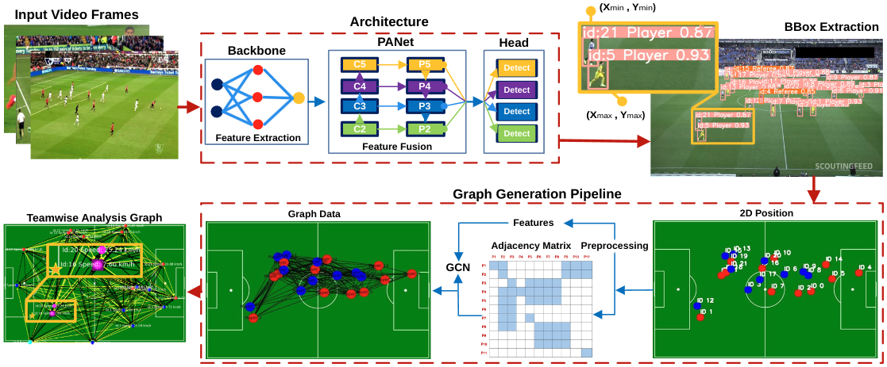

# [Scientific Reports] Real-Time Analysis of Soccer Ball-Player Interactions using Graph Convolutional Networks for Enhanced Game Insights

  [](README.md)

<div align="center">
  
</div>

### 1. Installation

GameFlow is developed based on `torch==2.3.0` `pytorch-cuda==12.1` and `CUDA Version==12.6`. 

#### 2.Clone Project 

```bash
git clone https://github.com/MrFahad/GameFlow.git
```

#### 3.Create and activate a conda environment.
```bash
conda create -n gameflow -y python=3.11
conda activate gameflow
```

#### 4. Install torch

```bash
pip3 install torch===2.3.0 torchvision torchaudio
```

#### 5. Install Dependencies
```bash
pip install ultralytics roboflow supervision
```

#### 6. Prepare your Dataset
Make sure your dataset structure as follows:
```
├── name_of_your_dataset
│   ├── annotations
│   │   ├── instances_train.json
│   │   └── instances_val.json
│   ├── images
│   │   ├── train
│   │   └── val
│   ├── labels
│   │   ├── train
│   │   ├── val
```

#### Training 
```bash
!yolo task=detect mode=train model=yolov8x.pt data={dataset.location}/data.yaml epochs=500 imgsz=640 plots=True
```
#### Validation
```bash
!yolo task=detect mode=val model={HOME}/runs/detect/train/weights/best.pt data={dataset.location}/data.yaml
```
#### Inference
```bash
!yolo task=detect mode=predict model={HOME}/runs/detect/train/weights/best.pt conf=0.25 source={dataset.location}/test/images save=True
```

#### Finetune on your best.pt model
```bash
!yolo task=detect mode=train model={HOME}/runs/detect/train/weights/best.pt data={dataset.location}/data.yaml epochs=500 imgsz=640 plots=True
```

## Visualizations:
> Uni-direction vs. Multi-direction.
<div align="center">
  
</div>

## Acknowledgement

This repository builds upon the real-time object detection adapted from [Ultralytics](https://github.com/ultralytics/ultralytics)

## Citations
If you find [3MT](https://github.com/MrFahad/GameFlow.git) is useful in your research or applications, please consider giving us a star 🌟 and citing it.

```bibtex
@misc{majeed2025_gameflow,
      title={Real-Time Analysis of Soccer Ball-Player Interactions using Graph Convolutional Networks for Enhanced Game Insights}, 
      author={Fahad Majeed, Maria Nazir, Kamilla Swart-Arries, Marco Agus, Jens Schneider},
      year={2025},
}
```
